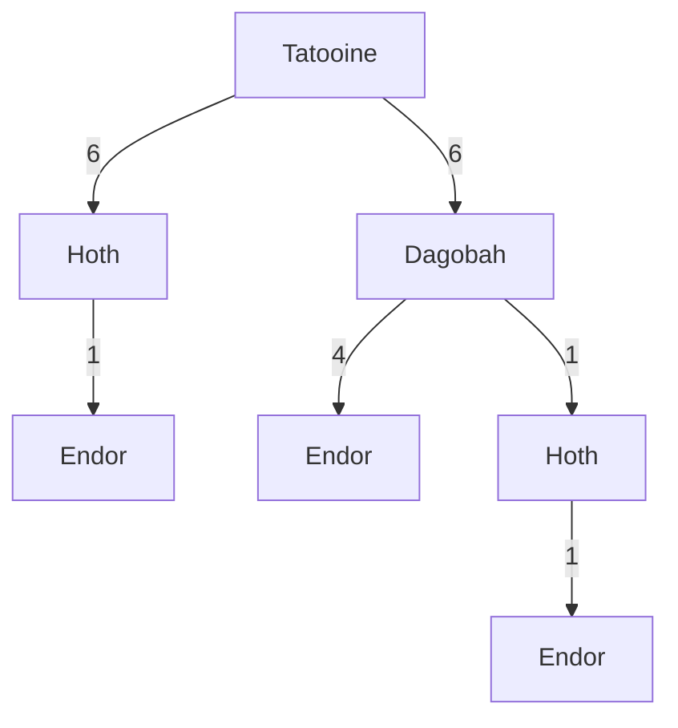

# What are the odds?

In order to tackle this problem, I would first need to list out all the possible paths that you can take between Tatooine and Endor. 



You can do this in different ways. The most obvious way that I first thought of was to create a generic tree (not a binary tree, because there is a possibility of having more than two planets on each level). Each node in the tree would contain information about the travel time, and the name of the planet.  

However, this proved to be difficult to access, store and search through in python, so I ended up representing the routes in a nested list, which looks like:
```
[
	[0, Tatooine, 6, Dagobah, 4, Endor],
	[0, Tatooine, 6, Dagobah, 1, Hoth, 1, Endor],
	[0, Tatooine, 6, Hoth, 1, Endor],
]
```

Definitely not the cleanest way to represent the data, but it works for now. 

These aren't the only possible routes that you can take, though. If you have enough float days (excess days) in the travel/refuel path, you can also choose to wait at a previous planet in order to evade the enemy.

For example, if the countdown is 10, then the second path would have `float_days` of 1, and the third path would have `float_days` of 2.

```
[
	[0, Tatooine, 6, Dagobah, 4, Endor],
	[0, Tatooine, 6, Dagobah, 1, Hoth, 1, Endor],
	[0, Tatooine, 6, Hoth, 1, Endor],
	
	# extra generated routes, accounting for float days:
	
	# float day of 1:
	[0, Tatooine, 1, Wait, 6, Dagobah, 1, Hoth, 1, Endor],
	[0, Tatooine, 6, Dagobah, 1, Wait, 1, Hoth, 1, Endor],
	
	# float day of 2:
	[0, Tatooine, 1, Wait, 6, Hoth, 1, Endor], #only use 1 float day
	[0, Tatooine, 2, Wait, 6, Hoth, 1, Endor],
]
```

You would then calculate the probability of being caught for each route, and return the greatest probability. 